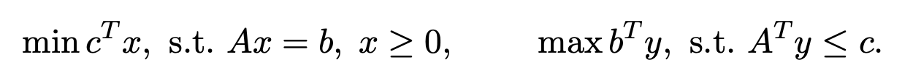

# A Computational Study: Primal-Dual Hybrid Gradient (PDHG) Algorithm for Linear Programming

The code `my_pdhg.m` implemented a **first-order method** for solving the following standard LP pair:

where \( b \) and \( c \) are nonzero vectors.

Please refer to `problem.pdf` and `report.pdf` for details.
